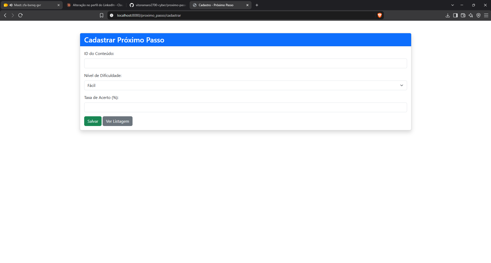
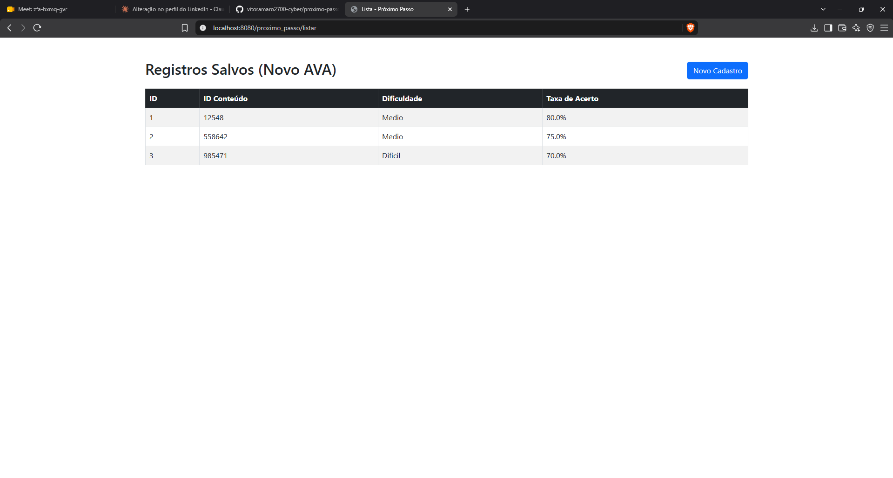

# Próximo Passo

Aplicação web em Java que registra o **nível de dificuldade** e a **taxa de acerto** de conteúdos de um ambiente virtual de aprendizagem (AVA). Esses dados são a base para recomendar o próximo passo de estudo do aluno.

Projeto acadêmico do curso de Análise e Desenvolvimento de Sistemas, desenvolvido em equipe.

## Funcionalidades

- Cadastro de registro com ID do conteúdo, nível de dificuldade (Fácil, Médio ou Difícil) e taxa de acerto (%)
- Listagem dos registros salvos em tabela
- Persistência local em SQLite, criada automaticamente na primeira execução

## Telas





## Tecnologias

- Java 17
- Spring Boot 3.5 (Web, Data JPA, Thymeleaf)
- SQLite com Hibernate Community Dialects
- Bootstrap 5 (via CDN)
- Maven (wrapper incluso)

## Como executar

Requisitos: **Java 17** ou superior. O Maven não precisa estar instalado.

```bash
git clone https://github.com/vitoramaro2700-cyber/proximo-passo.git
cd proximo-passo
./mvnw spring-boot:run
```

No Windows, use `mvnw.cmd spring-boot:run`.

Depois, acesse: <http://localhost:8080/proximo_passo/cadastrar>

O arquivo `proximopasso.db` é criado na pasta do projeto ao iniciar.

## Rotas

| Método | Rota | Descrição |
|--------|------|-----------|
| GET | `/proximo_passo/cadastrar` | Formulário de cadastro |
| POST | `/proximo_passo/salvar` | Salva o registro e redireciona para a listagem |
| GET | `/proximo_passo/listar` | Lista os registros |

## Estrutura

```
src/main/java/com/ava/proximo_passo/
├── ProximoPassoApplication.java
├── controller/ProximoPassoController.java
├── model/ProximoPassoModel.java
└── repository/ProximoPassoRepository.java
src/main/resources/
├── application.properties
└── templates/
    ├── proximo_passo_forms.html
    └── proximo_passo_listar.html
```

## Modelo de dados

| Campo | Tipo | Descrição |
|-------|------|-----------|
| `id` | Long | Identificador gerado automaticamente |
| `conteudo_id` | Long | ID do conteúdo avaliado |
| `nivel_dificuldade` | String | Fácil, Médio ou Difícil |
| `taxa_acerto` | Double | Percentual de acerto |

## Próximos passos

- [ ] Editar e excluir registros
- [ ] Filtrar por nível de dificuldade
- [ ] Página de detalhes de um registro
- [ ] Regra de recomendação do próximo conteúdo a partir da taxa de acerto
- [ ] Validação dos campos do formulário

## Autor

**Vitor Amaro**
[LinkedIn](https://www.linkedin.com/in/vitor-amaroo)
